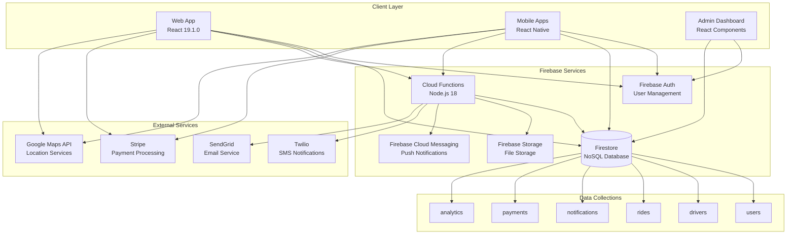
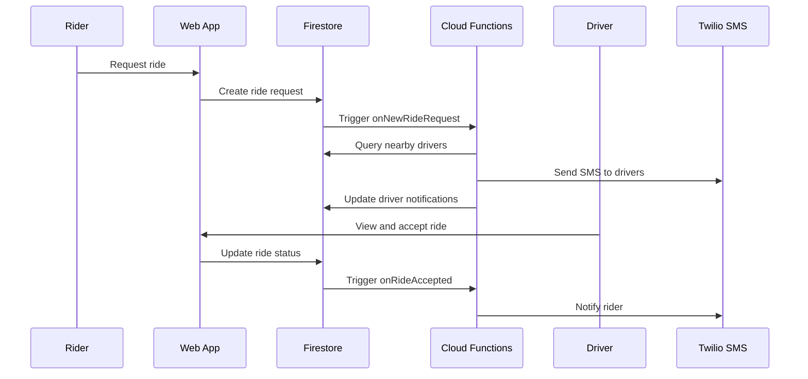
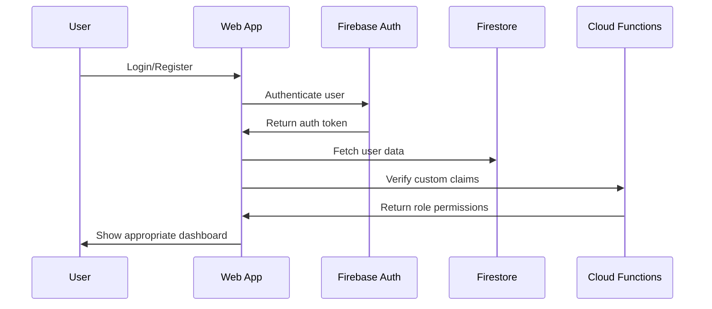

# AnyRyde Platform Architecture

## System Overview
AnyRyde is a modern ride-sharing platform built with a microservices architecture using Firebase as the backend-as-a-service (BaaS) provider.

## Architecture Diagram

## Core Components

### 1. Frontend Applications
- **Web App**: React-based progressive web application
- **Mobile Apps**: React Native applications for iOS/Android
- **Admin Dashboard**: Administrative interface for platform management

### 2. Backend Services
- **Firebase Functions**: Serverless backend logic
- **Firestore**: Real-time NoSQL database
- **Firebase Auth**: Authentication and authorization
- **Firebase Storage**: File and document storage

### 3. External Integrations
- **Twilio**: SMS notifications and communication
- **Stripe**: Payment processing and payouts
- **Google Maps**: Location services and routing
- **SendGrid**: Email delivery service

## Data Flow

### Ride Request Flow

### Authentication Flow

## Security Architecture

### Authentication & Authorization
- **Firebase Auth**: Primary authentication provider
- **Custom Claims**: Role-based access control (admin, driver, rider)
- **Firestore Rules**: Database-level security rules
- **CORS Configuration**: Cross-origin request protection

### Data Protection
- **Encryption**: All data encrypted in transit and at rest
- **Secure Storage**: Firebase handles encryption automatically
- **API Security**: Firebase Functions with authentication middleware
- **Input Validation**: Client and server-side validation

## Scalability Considerations

### Firebase Limitations
- **Firestore**: 1M reads/day (free tier), 10K writes/day
- **Functions**: 125K invocations/month (free tier)
- **Storage**: 5GB storage (free tier)

### Optimization Strategies
- **Query Optimization**: Composite indexes for complex queries
- **Caching**: React Query for client-side caching
- **Real-time Subscriptions**: Efficient listener management
- **Batch Operations**: Bulk writes for better performance

## Monitoring & Analytics

### Built-in Monitoring
- **Firebase Analytics**: User behavior tracking
- **Cloud Functions Logs**: Server-side error monitoring
- **Performance Monitoring**: App performance metrics

### Custom Analytics
- **Ride Metrics**: Success rates, completion times
- **Driver Performance**: Acceptance rates, ratings
- **Financial Metrics**: Revenue, payouts, disputes
- **Safety Metrics**: Incident reports, emergency alerts

## Deployment Architecture

### Environment Strategy
- **Development**: Local Firebase emulators
- **Staging**: Firebase project with test data
- **Production**: Firebase project with live data

### CI/CD Pipeline
- **Code Quality**: ESLint, Prettier, TypeScript
- **Testing**: Jest, React Testing Library
- **Deployment**: Firebase CLI, Netlify for web hosting
- **Monitoring**: Firebase Console, custom dashboards

## Performance Optimization

### Frontend Optimization
- **Code Splitting**: Route-based lazy loading
- **Bundle Optimization**: Webpack optimization
- **Caching**: Service worker for offline support
- **Image Optimization**: Compressed assets, lazy loading

### Backend Optimization
- **Function Optimization**: Cold start minimization
- **Database Optimization**: Query optimization, indexing
- **Caching**: Redis for frequently accessed data
- **CDN**: Firebase Hosting with global CDN

## Future Enhancements

### Planned Features
- **Microservices Migration**: Move to dedicated backend services
- **Real-time Analytics**: Advanced reporting and insights
- **AI/ML Integration**: Enhanced matching and pricing
- **Multi-tenant Architecture**: Support for multiple cities/regions

### Technical Debt
- **TODO**: Implement comprehensive error handling
- **TODO**: Add integration tests for critical paths
- **TODO**: Optimize bundle size and loading performance
- **TODO**: Implement advanced caching strategies
