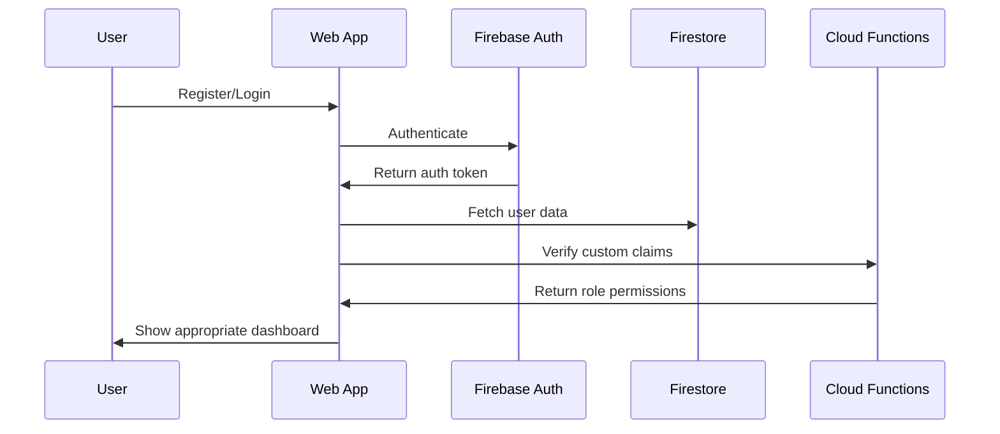

# Authentication System Documentation

## Overview
The AnyRyde platform uses Firebase Authentication with custom claims for role-based access control. This system handles user registration, login, password management, and authorization across the platform.

## Architecture

### Authentication Flow


## User Roles

### Role Hierarchy
```javascript
export const USER_ROLES = {
  CUSTOMER: 'customer',        // Standard rider account
  DRIVER: 'driver',           // Driver account with additional permissions
  ADMIN: 'admin',             // Administrative access
  SUPER_ADMIN: 'super_admin'  // Full platform access
};
```

### Role Permissions

#### Customer (Rider)
- **Ride Management**: Request, track, and complete rides
- **Profile Management**: Update personal information
- **Payment**: Manage payment methods
- **History**: View ride history
- **Safety**: Access safety features

#### Driver
- **All Customer Permissions**: Inherit rider capabilities
- **Driver Features**: Accept rides, manage availability
- **Earnings**: View earnings and payouts
- **Documents**: Upload and manage driver documents
- **Onboarding**: Complete driver application process

#### Admin
- **All Driver Permissions**: Inherit driver capabilities
- **User Management**: Manage users and drivers
- **Ride Oversight**: Monitor and manage rides
- **Analytics**: Access platform analytics
- **Support**: Handle support tickets

#### Super Admin
- **All Admin Permissions**: Inherit admin capabilities
- **System Management**: Configure platform settings
- **User Roles**: Manage user roles and permissions
- **Billing**: Access billing and financial data
- **Platform Control**: Full platform administration

## Authentication Service

### Core Functions

#### User Registration
```javascript
export const registerUser = async (userData) => {
  try {
    // Create Firebase Auth user
    const userCredential = await createUserWithEmailAndPassword(
      auth, 
      userData.email, 
      userData.password
    );
    
    // Create user document in Firestore
    await setDoc(doc(db, 'users', userCredential.user.uid), {
      uid: userCredential.user.uid,
      email: userData.email,
      displayName: `${userData.firstName} ${userData.lastName}`,
      role: userData.userType === 'driver' ? 'driver' : 'customer',
      userType: userData.userType,
      personalInfo: {
        firstName: userData.firstName,
        lastName: userData.lastName,
        phone: userData.phone,
        dateOfBirth: userData.dateOfBirth
      },
      preferences: {
        language: 'en',
        timezone: Intl.DateTimeFormat().resolvedOptions().timeZone,
        notifications: {
          push: true,
          email: true,
          sms: false
        }
      },
      isActive: true,
      isOnboarded: false,
      createdAt: serverTimestamp(),
      updatedAt: serverTimestamp()
    });
    
    // Send email verification
    await sendEmailVerification(userCredential.user);
    
    return { 
      success: true, 
      user: userCredential.user,
      message: 'Registration successful. Please verify your email.'
    };
  } catch (error) {
    console.error('Registration error:', error);
    return { 
      success: false, 
      error: getErrorMessage(error) 
    };
  }
};
```

#### User Login
```javascript
export const loginUser = async (email, password) => {
  try {
    // Authenticate with Firebase
    const userCredential = await signInWithEmailAndPassword(auth, email, password);
    const user = userCredential.user;
    
    // Check email verification
    if (!user.emailVerified) {
      await sendEmailVerification(user);
      return {
        success: false,
        error: 'Please verify your email before logging in. A new verification email has been sent.'
      };
    }
    
    // Get user data from Firestore
    const userData = await getUserData(user.uid);
    
    if (!userData.success) {
      return {
        success: false,
        error: 'User data not found. Please contact support.'
      };
    }
    
    // Check if user is active
    if (!userData.data.isActive) {
      return {
        success: false,
        error: 'Account is deactivated. Please contact support.'
      };
    }
    
    return {
      success: true,
      user: {
        uid: user.uid,
        email: user.email,
        displayName: user.displayName,
        emailVerified: user.emailVerified,
        ...userData.data
      }
    };
  } catch (error) {
    console.error('Login error:', error);
    return {
      success: false,
      error: getErrorMessage(error)
    };
  }
};
```

#### Password Reset
```javascript
export const resetPassword = async (email) => {
  try {
    await sendPasswordResetEmail(auth, email);
    return {
      success: true,
      message: 'Password reset email sent. Please check your inbox.'
    };
  } catch (error) {
    console.error('Password reset error:', error);
    return {
      success: false,
      error: getErrorMessage(error)
    };
  }
};
```

#### User Logout
```javascript
export const logoutUser = async () => {
  try {
    await signOut(auth);
    return { success: true };
  } catch (error) {
    console.error('Logout error:', error);
    return {
      success: false,
      error: 'Failed to logout. Please try again.'
    };
  }
};
```

### Role Management

#### Check User Role
```javascript
export const isAdmin = (user) => {
  return user && (user.role === 'admin' || user.role === 'super_admin');
};

export const isDriver = (user) => {
  return user && (user.role === 'driver' || user.role === 'admin' || user.role === 'super_admin');
};

export const isSuperAdmin = (user) => {
  return user && user.role === 'super_admin';
};
```

#### Get Redirect Path
```javascript
export const getRedirectPath = (user) => {
  if (!user) return '/login';
  
  switch (user.role) {
    case 'super_admin':
    case 'admin':
      return '/admin-dashboard';
    case 'driver':
      return '/driver-dashboard';
    case 'customer':
    default:
      return '/dashboard';
  }
};
```

#### Update User Role
```javascript
export const updateUserRole = async (userId, newRole) => {
  try {
    // Update Firestore document
    await updateDoc(doc(db, 'users', userId), {
      role: newRole,
      updatedAt: serverTimestamp()
    });
    
    // Update Firebase Auth custom claims
    await admin.auth().setCustomUserClaims(userId, { role: newRole });
    
    return { success: true };
  } catch (error) {
    console.error('Role update error:', error);
    return {
      success: false,
      error: 'Failed to update user role'
    };
  }
};
```

## Authentication Context

### AuthContext Implementation
```javascript
export const AuthProvider = ({ children }) => {
  const [user, setUser] = useState(null);
  const [loading, setLoading] = useState(true);
  const [error, setError] = useState(null);
  
  useEffect(() => {
    const unsubscribe = onAuthStateChange(async (firebaseUser) => {
      try {
        if (firebaseUser) {
          // Get additional user data from Firestore
          const userData = await getUserData(firebaseUser.uid);
          
          if (userData.success) {
            setUser({
              uid: firebaseUser.uid,
              email: firebaseUser.email,
              displayName: firebaseUser.displayName,
              emailVerified: firebaseUser.emailVerified,
              photoURL: firebaseUser.photoURL,
              ...userData.data
            });
          } else {
            setError('Failed to load user data');
          }
        } else {
          setUser(null);
        }
      } catch (error) {
        console.error('Auth state change error:', error);
        setError('Authentication error');
      } finally {
        setLoading(false);
      }
    });
    
    return unsubscribe;
  }, []);
  
  const value = {
    user,
    loading,
    error,
    isAuthenticated: !!user,
    isAdmin: isAdmin(user),
    isDriver: isDriver(user),
    isSuperAdmin: isSuperAdmin(user)
  };
  
  return (
    <AuthContext.Provider value={value}>
      {children}
    </AuthContext.Provider>
  );
};
```

### Custom Hooks
```javascript
export const useAuth = () => {
  const context = useContext(AuthContext);
  if (!context) {
    throw new Error('useAuth must be used within an AuthProvider');
  }
  return context;
};

export const useRequireAuth = () => {
  const { user, loading } = useAuth();
  
  if (loading) return null;
  if (!user) return <Navigate to="/login" replace />;
  
  return user;
};

export const useRequireRole = (requiredRole) => {
  const { user, loading } = useAuth();
  
  if (loading) return null;
  if (!user) return <Navigate to="/login" replace />;
  if (!hasRole(user, requiredRole)) return <Navigate to="/dashboard" replace />;
  
  return user;
};
```

## Route Protection

### Protected Routes
```javascript
const ProtectedRoute = ({ children }) => {
  const { isAuthenticated, loading } = useAuth();
  
  if (loading) {
    return <LoadingSpinner />;
  }
  
  return isAuthenticated ? children : <Navigate to="/login" replace />;
};

const AdminRoute = ({ children }) => {
  const { user, isAuthenticated, loading } = useAuth();
  
  if (loading) {
    return <LoadingSpinner />;
  }
  
  if (!isAuthenticated) {
    return <Navigate to="/login" replace />;
  }
  
  if (!isAdmin(user)) {
    return <Navigate to="/dashboard" replace />;
  }
  
  return children;
};

const DriverRoute = ({ children }) => {
  const { user, isAuthenticated, loading } = useAuth();
  
  if (loading) {
    return <LoadingSpinner />;
  }
  
  if (!isAuthenticated) {
    return <Navigate to="/login" replace />;
  }
  
  if (!isDriver(user)) {
    return <Navigate to="/dashboard" replace />;
  }
  
  return children;
};
```

### Route Configuration
```javascript
<Routes>
  {/* Public routes */}
  <Route path="/login" element={<PublicRoute><LoginPage /></PublicRoute>} />
  <Route path="/register" element={<PublicRoute><RegisterPage /></PublicRoute>} />
  
  {/* Protected routes */}
  <Route path="/dashboard" element={<ProtectedRoute><DashboardPage /></ProtectedRoute>} />
  <Route path="/driver-dashboard" element={<DriverRoute><DriverDashboardPage /></DriverRoute>} />
  <Route path="/admin-dashboard" element={<AdminRoute><AdminDashboardPage /></AdminRoute>} />
</Routes>
```

## Security Features

### Email Verification
```javascript
export const sendEmailVerification = async (user) => {
  try {
    await sendEmailVerification(user);
    return { success: true };
  } catch (error) {
    console.error('Email verification error:', error);
    return {
      success: false,
      error: 'Failed to send verification email'
    };
  }
};

export const checkEmailVerification = async (user) => {
  try {
    await reload(user);
    return user.emailVerified;
  } catch (error) {
    console.error('Email verification check error:', error);
    return false;
  }
};
```

### Account Security
```javascript
export const deleteUserAccount = async (userId) => {
  try {
    // Delete user document from Firestore
    await deleteDoc(doc(db, 'users', userId));
    
    // Delete user from Firebase Auth
    await deleteUser(auth.currentUser);
    
    return { success: true };
  } catch (error) {
    console.error('Account deletion error:', error);
    return {
      success: false,
      error: 'Failed to delete account'
    };
  }
};
```

### Session Management
```javascript
export const refreshUserSession = async () => {
  try {
    const user = auth.currentUser;
    if (user) {
      await reload(user);
      const userData = await getUserData(user.uid);
      
      if (userData.success) {
        return {
          success: true,
          user: {
            uid: user.uid,
            email: user.email,
            displayName: user.displayName,
            emailVerified: user.emailVerified,
            ...userData.data
          }
        };
      }
    }
    
    return { success: false, error: 'No active session' };
  } catch (error) {
    console.error('Session refresh error:', error);
    return {
      success: false,
      error: 'Failed to refresh session'
    };
  }
};
```

## Error Handling

### Error Messages
```javascript
const getErrorMessage = (error) => {
  switch (error.code) {
    case 'auth/user-not-found':
      return 'No account found with this email address.';
    case 'auth/wrong-password':
      return 'Incorrect password. Please try again.';
    case 'auth/email-already-in-use':
      return 'An account with this email already exists.';
    case 'auth/weak-password':
      return 'Password should be at least 6 characters.';
    case 'auth/invalid-email':
      return 'Please enter a valid email address.';
    case 'auth/user-disabled':
      return 'This account has been disabled. Please contact support.';
    case 'auth/too-many-requests':
      return 'Too many failed attempts. Please try again later.';
    default:
      return 'An error occurred. Please try again.';
  }
};
```

### Error Boundaries
```javascript
class AuthErrorBoundary extends Component {
  constructor(props) {
    super(props);
    this.state = { hasError: false, error: null };
  }
  
  static getDerivedStateFromError(error) {
    return { hasError: true, error };
  }
  
  componentDidCatch(error, errorInfo) {
    console.error('Auth error:', error, errorInfo);
    // Log to error tracking service
  }
  
  render() {
    if (this.state.hasError) {
      return (
        <div className="auth-error">
          <h2>Authentication Error</h2>
          <p>Something went wrong with authentication. Please try refreshing the page.</p>
          <button onClick={() => window.location.reload()}>
            Refresh Page
          </button>
        </div>
      );
    }
    
    return this.props.children;
  }
}
```

## Testing

### Unit Tests
```javascript
describe('Authentication Service', () => {
  it('should register user successfully', async () => {
    const userData = {
      email: 'test@example.com',
      password: 'password123',
      firstName: 'John',
      lastName: 'Doe',
      userType: 'customer'
    };
    
    const result = await registerUser(userData);
    expect(result.success).toBe(true);
    expect(result.user.email).toBe(userData.email);
  });
  
  it('should handle login with valid credentials', async () => {
    const result = await loginUser('test@example.com', 'password123');
    expect(result.success).toBe(true);
    expect(result.user).toBeDefined();
  });
  
  it('should reject login with invalid credentials', async () => {
    const result = await loginUser('test@example.com', 'wrongpassword');
    expect(result.success).toBe(false);
    expect(result.error).toContain('Incorrect password');
  });
});
```

### Integration Tests
```javascript
describe('Authentication Flow', () => {
  it('should complete full authentication flow', async () => {
    // Register user
    const registration = await registerUser(validUserData);
    expect(registration.success).toBe(true);
    
    // Login user
    const login = await loginUser(validUserData.email, validUserData.password);
    expect(login.success).toBe(true);
    
    // Verify user data
    expect(login.user.role).toBe('customer');
    expect(login.user.isActive).toBe(true);
  });
});
```

## Security Best Practices

### Password Security
- Minimum 8 characters
- Mix of uppercase, lowercase, numbers, and symbols
- No common passwords
- Regular password updates

### Session Security
- Automatic session timeout
- Secure session storage
- CSRF protection
- XSS prevention

### Account Security
- Email verification required
- Account lockout after failed attempts
- Suspicious activity monitoring
- Regular security audits

### Data Protection
- Encrypted data transmission
- Secure data storage
- Privacy compliance (GDPR, CCPA)
- Regular security updates

## Monitoring and Analytics

### Authentication Metrics
- **Sign-up Rate**: New user registrations
- **Login Success Rate**: Successful authentication attempts
- **Password Reset Rate**: Password reset requests
- **Account Lockout Rate**: Failed login attempts

### Security Monitoring
- **Failed Login Attempts**: Track suspicious activity
- **Account Compromises**: Monitor for security breaches
- **Session Anomalies**: Detect unusual session patterns
- **Role Escalation**: Monitor privilege changes

### User Behavior Analytics
- **Login Patterns**: User login frequency and timing
- **Feature Usage**: Track feature adoption by role
- **Session Duration**: Monitor user engagement
- **Geographic Access**: Track login locations

## Troubleshooting

### Common Issues

#### 1. Email Verification Problems
```javascript
// Check email verification status
const checkVerification = async () => {
  const user = auth.currentUser;
  if (user) {
    await reload(user);
    console.log('Email verified:', user.emailVerified);
  }
};
```

#### 2. Role Assignment Issues
```javascript
// Verify custom claims
const checkCustomClaims = async () => {
  const user = auth.currentUser;
  if (user) {
    const tokenResult = await user.getIdTokenResult();
    console.log('Custom claims:', tokenResult.claims);
  }
};
```

#### 3. Session Expiry
```javascript
// Handle session expiry
const handleSessionExpiry = () => {
  // Clear local state
  setUser(null);
  // Redirect to login
  navigate('/login');
  // Show message
  toast.error('Session expired. Please login again.');
};
```

### Debug Mode
```javascript
// Enable debug logging
const DEBUG_AUTH = process.env.REACT_APP_DEBUG_AUTH === 'true';

const debugAuth = (message, data) => {
  if (DEBUG_AUTH) {
    console.log(`[AUTH DEBUG] ${message}`, data);
  }
};
```
