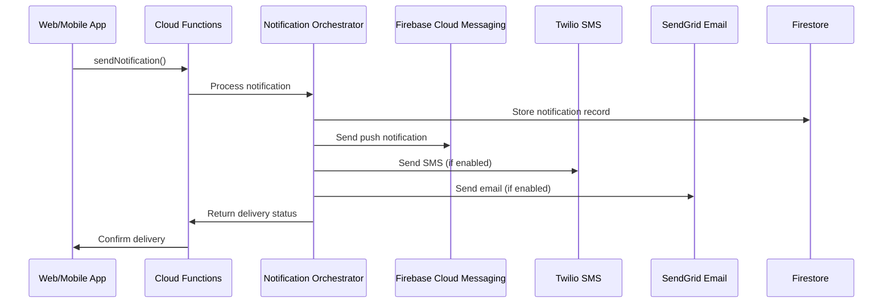

# Notification System Documentation

## Overview
The AnyRyde notification system provides multi-channel communication (push, SMS, email) to keep users informed about ride updates, safety alerts, and platform notifications.

## Architecture

### Notification Flow


## Core Components

### 1. Notification Orchestrator
**File**: `functions/services/notificationOrchestrator.js`

**Purpose**: Central service that coordinates multi-channel notification delivery

**Key Features**:
- Channel selection based on user preferences
- Retry logic for failed deliveries
- Delivery status tracking
- Rate limiting and throttling

### 2. Cloud Functions
**File**: `functions/index.js`

**Functions**:
- `sendNotification`: HTTP callable function for sending notifications
- `onDriverApplicationApproved`: Firestore trigger for driver approvals
- `onRideAccepted`: Firestore trigger for ride status changes
- `onNewRideRequest`: Firestore trigger for new ride requests
- `sendScheduledRideReminders`: Scheduled function for ride reminders
- `onEmergencyAlert`: Firestore trigger for emergency alerts

### 3. Client Services
**File**: `src/services/notificationService.js`

**Purpose**: Client-side notification management and preferences

## Notification Types

### 1. Ride-Related Notifications

#### Ride Request
```javascript
{
  type: 'ride_request',
  priority: 'high',
  title: 'New Ride Request! 🚗',
  body: 'Pickup → Destination. Fare: $X.XX',
  channels: ['push', 'sms'],
  data: {
    rideRequestId: string,
    pickup: object,
    destination: object,
    estimatedFare: number,
    expiresAt: timestamp
  }
}
```

#### Ride Accepted
```javascript
{
  type: 'ride_accepted',
  priority: 'high',
  title: 'Driver On The Way! 🚗',
  body: 'Driver Name is coming to pick you up. ETA: X minutes',
  channels: ['push', 'sms'],
  data: {
    rideId: string,
    driverId: string,
    driverName: string,
    driverPhoto: string,
    vehicleInfo: object,
    eta: string
  }
}
```

#### Driver Arrived
```javascript
{
  type: 'driver_arrived',
  priority: 'high',
  title: 'Driver Has Arrived! 📍',
  body: 'Your driver is waiting at the pickup location.',
  channels: ['push', 'sms'],
  data: {
    rideId: string,
    driverId: string,
    location: object
  }
}
```

#### Ride Completed
```javascript
{
  type: 'ride_completed',
  priority: 'medium',
  title: 'Ride Completed ✅',
  body: 'Your ride is complete. Total: $X.XX. Thank you for riding with AnyRyde!',
  channels: ['push', 'sms', 'email'],
  data: {
    rideId: string,
    totalFare: number,
    receipt: true
  }
}
```

#### Ride Cancelled
```javascript
{
  type: 'ride_cancelled',
  priority: 'high',
  title: 'Ride Cancelled',
  body: 'Your ride has been cancelled. Reason: [reason]',
  channels: ['push', 'sms'],
  data: {
    rideId: string,
    cancelledBy: 'rider' | 'driver' | 'system',
    reason: string
  }
}
```

### 2. Driver Application Notifications

#### Application Approved
```javascript
{
  type: 'driver_application_approved',
  priority: 'high',
  title: '🎉 Congratulations!',
  body: 'Your AnyRyde driver application has been approved! You can now start accepting rides.',
  channels: ['push', 'sms', 'email'],
  data: {
    applicationId: string,
    approvedAt: timestamp
  }
}
```

#### Application Rejected
```javascript
{
  type: 'driver_application_rejected',
  priority: 'high',
  title: 'Application Update Required',
  body: 'Your driver application requires additional review. Please check your email for details.',
  channels: ['push', 'email'],
  data: {
    applicationId: string,
    reason: string
  }
}
```

### 3. Scheduled Ride Reminders

#### 24-Hour Reminder
```javascript
{
  type: 'scheduled_ride_reminder_24hr',
  priority: 'medium',
  title: 'Ride Reminder 📅',
  body: 'Your ride is scheduled for tomorrow at [time]',
  channels: ['push', 'sms'],
  data: {
    rideId: string,
    scheduledTime: timestamp,
    pickup: object
  }
}
```

#### 1-Hour Reminder
```javascript
{
  type: 'scheduled_ride_reminder_1hr',
  priority: 'high',
  title: 'Ride Starting Soon! ⏰',
  body: 'Your ride is scheduled in 1 hour. Pickup at [location]',
  channels: ['push', 'sms'],
  data: {
    rideId: string,
    scheduledTime: timestamp,
    pickup: object
  }
}
```

### 4. Emergency Alerts

#### Emergency Alert
```javascript
{
  type: 'emergency_alert',
  priority: 'critical',
  title: '🚨 Emergency Alert Received',
  body: 'Your emergency alert has been received. Help is on the way. Stay safe.',
  channels: ['push', 'sms'],
  data: {
    alertId: string,
    location: object,
    emergencyType: string
  }
}
```

#### Emergency Contact Alert
```javascript
{
  type: 'emergency_contact_alert',
  priority: 'critical',
  title: '🚨 Emergency Alert',
  body: '[User Name] has triggered an emergency alert. Location: [address]',
  channels: ['sms'],
  data: {
    alertId: string,
    location: object
  }
}
```

## Notification Channels

### 1. Push Notifications (Firebase Cloud Messaging)

#### Setup
```javascript
// Firebase configuration
import { getMessaging, getToken } from 'firebase/messaging';

const messaging = getMessaging();

// Request permission and get token
const requestPermission = async () => {
  const permission = await Notification.requestPermission();
  if (permission === 'granted') {
    const token = await getToken(messaging, {
      vapidKey: process.env.REACT_APP_VAPID_KEY
    });
    return token;
  }
  return null;
};
```

#### Service Worker
```javascript
// public/firebase-messaging-sw.js
importScripts('https://www.gstatic.com/firebasejs/9.0.0/firebase-app-compat.js');
importScripts('https://www.gstatic.com/firebasejs/9.0.0/firebase-messaging-compat.js');

firebase.initializeApp({
  apiKey: "your-api-key",
  authDomain: "your-project.firebaseapp.com",
  projectId: "your-project-id",
  storageBucket: "your-project.appspot.com",
  messagingSenderId: "your-sender-id",
  appId: "your-app-id"
});

const messaging = firebase.messaging();

messaging.onBackgroundMessage((payload) => {
  console.log('Received background message:', payload);
  
  const notificationTitle = payload.notification.title;
  const notificationOptions = {
    body: payload.notification.body,
    icon: '/logo192.png',
    badge: '/logo192.png',
    data: payload.data
  };
  
  self.registration.showNotification(notificationTitle, notificationOptions);
});
```

### 2. SMS Notifications (Twilio)

#### Setup
```javascript
// Twilio configuration
const twilio = require('twilio');
const client = twilio(process.env.TWILIO_ACCOUNT_SID, process.env.TWILIO_AUTH_TOKEN);

const sendSMS = async (to, message) => {
  try {
    const result = await client.messages.create({
      body: message,
      from: process.env.TWILIO_PHONE_NUMBER,
      to: to
    });
    
    return { success: true, messageId: result.sid };
  } catch (error) {
    console.error('SMS sending failed:', error);
    return { success: false, error: error.message };
  }
};
```

#### SMS Templates
```javascript
const SMS_TEMPLATES = {
  ride_request: (data) => 
    `New ride request: ${data.pickup.address} → ${data.destination.address}. Fare: $${data.estimatedFare}. Accept: ${data.acceptUrl}`,
  
  ride_accepted: (data) => 
    `Driver ${data.driverName} is on the way! ETA: ${data.eta}. Track: ${data.trackUrl}`,
  
  emergency_alert: (data) => 
    `EMERGENCY: ${data.userName} needs help at ${data.location.address}. Call 911 if needed.`,
  
  ride_reminder: (data) => 
    `Reminder: Your ride is scheduled for ${data.scheduledTime}. Pickup: ${data.pickup.address}`
};
```

### 3. Email Notifications (SendGrid)

#### Setup
```javascript
// SendGrid configuration
const sgMail = require('@sendgrid/mail');
sgMail.setApiKey(process.env.SENDGRID_API_KEY);

const sendEmail = async (to, subject, htmlContent, textContent) => {
  try {
    const msg = {
      to: to,
      from: process.env.SENDGRID_FROM_EMAIL,
      subject: subject,
      text: textContent,
      html: htmlContent
    };
    
    await sgMail.send(msg);
    return { success: true };
  } catch (error) {
    console.error('Email sending failed:', error);
    return { success: false, error: error.message };
  }
};
```

#### Email Templates
```javascript
const EMAIL_TEMPLATES = {
  driver_approved: (data) => ({
    subject: '🎉 Welcome to AnyRyde - Your Application is Approved!',
    html: `
      <div style="font-family: Arial, sans-serif; max-width: 600px; margin: 0 auto;">
        <h1 style="color: #16a34a;">Congratulations!</h1>
        <p>Dear ${data.driverName},</p>
        <p>Great news! Your AnyRyde driver application has been approved. You can now start accepting rides and earning money.</p>
        <a href="${data.dashboardUrl}" style="background: #16a34a; color: white; padding: 12px 24px; text-decoration: none; border-radius: 6px; display: inline-block;">Go to Driver Dashboard</a>
      </div>
    `
  }),
  
  ride_receipt: (data) => ({
    subject: 'Your AnyRyde Ride Receipt',
    html: `
      <div style="font-family: Arial, sans-serif; max-width: 600px; margin: 0 auto;">
        <h2>Ride Receipt</h2>
        <p><strong>Date:</strong> ${data.date}</p>
        <p><strong>From:</strong> ${data.pickup}</p>
        <p><strong>To:</strong> ${data.destination}</p>
        <p><strong>Total:</strong> $${data.totalFare}</p>
      </div>
    `
  })
};
```

## User Preferences

### Notification Preferences Schema
```javascript
{
  userId: string,
  preferences: {
    push: {
      enabled: boolean,
      rideUpdates: boolean,
      promotions: boolean,
      safety: boolean,
      system: boolean
    },
    sms: {
      enabled: boolean,
      rideRequests: boolean,
      emergency: boolean,
      reminders: boolean
    },
    email: {
      enabled: boolean,
      receipts: boolean,
      promotions: boolean,
      updates: boolean
    }
  },
  quietHours: {
    enabled: boolean,
    startTime: string, // "22:00"
    endTime: string,   // "08:00"
    timezone: string
  },
  updatedAt: timestamp
}
```

### Preference Management
```javascript
// Update notification preferences
export const updateNotificationPreferences = async (userId, preferences) => {
  try {
    await updateDoc(doc(db, 'users', userId), {
      'notificationPreferences': preferences,
      'updatedAt': serverTimestamp()
    });
    
    return { success: true };
  } catch (error) {
    console.error('Failed to update preferences:', error);
    return { success: false, error: error.message };
  }
};

// Get user preferences
export const getNotificationPreferences = async (userId) => {
  try {
    const userDoc = await getDoc(doc(db, 'users', userId));
    if (userDoc.exists()) {
      return {
        success: true,
        preferences: userDoc.data().notificationPreferences
      };
    }
    return { success: false, error: 'User not found' };
  } catch (error) {
    console.error('Failed to get preferences:', error);
    return { success: false, error: error.message };
  }
};
```

## Delivery Status Tracking

### Notification Status Schema
```javascript
{
  notificationId: string,
  userId: string,
  type: string,
  priority: string,
  status: 'pending' | 'sent' | 'delivered' | 'failed',
  channels: {
    push: {
      status: 'pending' | 'sent' | 'delivered' | 'failed',
      messageId: string,
      sentAt: timestamp,
      deliveredAt: timestamp,
      error: string
    },
    sms: {
      status: 'pending' | 'sent' | 'delivered' | 'failed',
      messageId: string,
      sentAt: timestamp,
      deliveredAt: timestamp,
      error: string
    },
    email: {
      status: 'pending' | 'sent' | 'delivered' | 'failed',
      messageId: string,
      sentAt: timestamp,
      deliveredAt: timestamp,
      error: string
    }
  },
  createdAt: timestamp,
  updatedAt: timestamp
}
```

## Rate Limiting and Throttling

### Rate Limits
```javascript
const RATE_LIMITS = {
  push: {
    perUser: 100,        // per hour
    perApp: 10000        // per hour
  },
  sms: {
    perUser: 10,         // per hour
    perApp: 1000         // per hour
  },
  email: {
    perUser: 50,         // per hour
    perApp: 5000         // per hour
  }
};
```

### Throttling Implementation
```javascript
const checkRateLimit = async (userId, channel) => {
  const now = Date.now();
  const hourAgo = now - (60 * 60 * 1000);
  
  const notifications = await db.collection('notifications')
    .where('userId', '==', userId)
    .where('channels.' + channel + '.sentAt', '>', new Date(hourAgo))
    .get();
  
  const limit = RATE_LIMITS[channel].perUser;
  return notifications.size < limit;
};
```

## Testing

### Unit Tests
```javascript
// Test notification sending
describe('Notification Service', () => {
  it('should send push notification successfully', async () => {
    const mockNotification = {
      userId: 'test-user',
      title: 'Test Notification',
      body: 'This is a test',
      channels: ['push']
    };
    
    const result = await sendNotification(mockNotification);
    expect(result.success).toBe(true);
    expect(result.notificationId).toBeDefined();
  });
  
  it('should respect rate limits', async () => {
    const notifications = Array(15).fill().map((_, i) => ({
      userId: 'test-user',
      title: `Notification ${i}`,
      body: 'Test',
      channels: ['sms']
    }));
    
    const results = await Promise.all(
      notifications.map(n => sendNotification(n))
    );
    
    const successful = results.filter(r => r.success);
    expect(successful.length).toBeLessThanOrEqual(10);
  });
});
```

### Integration Tests
```javascript
// Test full notification flow
describe('Notification Flow', () => {
  it('should handle ride request notification', async () => {
    // Create ride request
    const rideRequest = await createRideRequest({
      pickup: { address: '123 Main St' },
      destination: { address: '456 Oak Ave' },
      estimatedFare: 15.50
    });
    
    // Verify notification was sent
    const notifications = await getNotificationsByType('ride_request');
    expect(notifications.length).toBeGreaterThan(0);
    
    const notification = notifications[0];
    expect(notification.data.rideRequestId).toBe(rideRequest.rideId);
    expect(notification.channels).toContain('push');
  });
});
```

## Monitoring and Analytics

### Notification Metrics
```javascript
// Track notification performance
const trackNotificationMetrics = async (notificationId, channel, status) => {
  await db.collection('notificationMetrics').add({
    notificationId,
    channel,
    status,
    timestamp: new Date(),
    userId: notification.userId,
    type: notification.type
  });
};
```

### Delivery Analytics
- **Delivery Rates**: Success rate by channel and type
- **Response Times**: Time from send to delivery
- **Error Rates**: Failed delivery analysis
- **User Engagement**: Click-through rates and interactions

## Security Considerations

### Data Privacy
- Encrypt sensitive data in notifications
- Use secure channels for sensitive information
- Implement data retention policies
- Comply with GDPR and privacy regulations

### Access Control
- Verify user permissions before sending notifications
- Implement notification preferences enforcement
- Use secure API keys and tokens
- Monitor for abuse and spam

### Content Security
- Sanitize user-generated content
- Implement content filtering
- Use secure templates
- Validate notification content

## Troubleshooting

### Common Issues

#### 1. Push Notifications Not Working
```javascript
// Check service worker registration
if ('serviceWorker' in navigator) {
  navigator.serviceWorker.register('/firebase-messaging-sw.js')
    .then(registration => console.log('SW registered'))
    .catch(error => console.log('SW registration failed'));
}

// Check FCM token
const token = await getToken(messaging);
console.log('FCM Token:', token);
```

#### 2. SMS Delivery Issues
```javascript
// Check Twilio configuration
const account = await client.api.accounts(process.env.TWILIO_ACCOUNT_SID).fetch();
console.log('Account Status:', account.status);

// Check phone number format
const isValidPhone = (phone) => {
  return /^\+[1-9]\d{1,14}$/.test(phone);
};
```

#### 3. Email Delivery Issues
```javascript
// Check SendGrid configuration
const response = await sgMail.send({
  to: 'test@example.com',
  from: process.env.SENDGRID_FROM_EMAIL,
  subject: 'Test',
  text: 'Test message'
});
console.log('Email Status:', response[0].statusCode);
```

### Debug Mode
```javascript
// Enable debug logging
const DEBUG_MODE = process.env.NODE_ENV === 'development';

const logNotification = (message, data) => {
  if (DEBUG_MODE) {
    console.log(`[Notification] ${message}`, data);
  }
};
```
